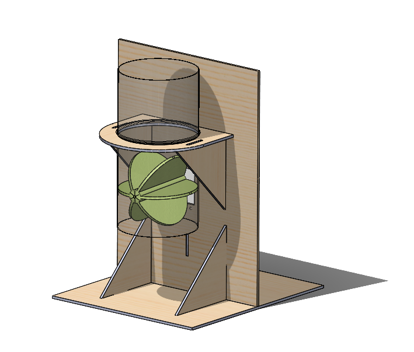

# ArduinoPet

*Оборудование - 3D-принтер Prusa i3 MK3, Лазерный гравер GCC Spirit GLS100*

*Материал и крепежные изделия - PLA (полилактид), фанерный лист, болты М3 30-35мм, гайки М3, шайбы*



Рисунок 1 - 3D-модель кормушки

Рисунок 2 - Сборка электроники

**Код**

```C++
    #include <NewPing.h> // библиотека УЗ-датчика
    #include <Servo.h> // библиотека сервопривода

    #define TRIGGER_PIN  10
    #define ECHO_PIN     11
    #define MAX_DISTANCE 400
     
    NewPing sonar(TRIGGER_PIN, ECHO_PIN, MAX_DISTANCE);
    Servo myservo;
    
    int pos = 0; // позиция привода (угол)
    int step = 45; // шаг поворота
    
    void setup() {
      Serial.begin(9600);
      myservo.attach(9);  // сервопривод на выводе 9
    }
     
    void loop() {
      Serial.print("Ping: ");
      Serial.print(sonar.ping_cm()); // смотрим значения датчика, чтобы определить нужный диапазон для работы
      Serial.println("cm");
      int val = sonar.ping_cm(); // переводим тип данных из newping в int
      if (val > 3 && val < 7){ // указываем диапазон для датчика приближения
        pos += step;
          if (pos >= 180 || pos <= 0){
            step = -step; // если привод достигает предельного значения по углу, меняет направление
          }
        myservo.write(pos);
        delay (500);
      }
    }
```
