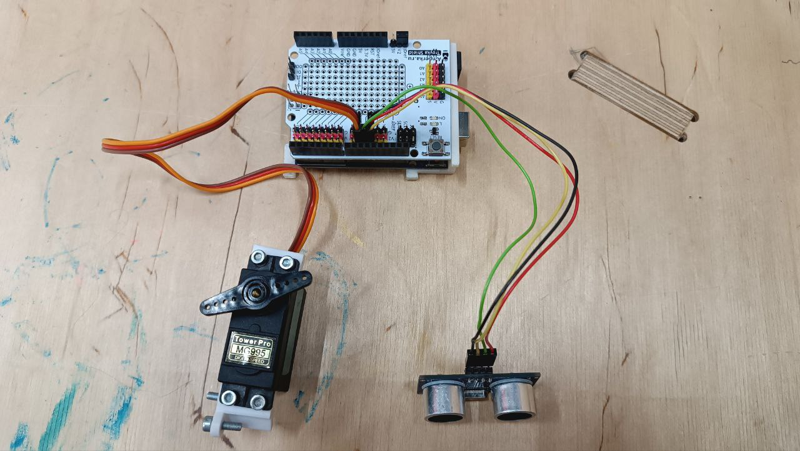

# ArduinoPet

*Оборудование - 3D-принтер Prusa i3 MK3, Лазерный гравер GCC Spirit GLS100*

*Материал и крепежные изделия - PLA (полилактид), фанерный лист, болты М3 20-30мм, гайки М3, шайбы*

*Доп. инструменты: дрель, штангенциркуль, шлифмашинка, шестигранник*

*Принцип работы: 
Ультразвуковой датчик выходит на контейнер для утилизации отхода. Фиксирует его сброс в контейнер. 
Запускает сервопривод, который зафиксирован на лопастях с помощью насадки. Лопасть делает один шаг и останавливается.*

[*Концепт*](https://docs.google.com/document/d/1xtoP0S_9u98pEW1-OkP4BSuOhZv14ZlKrBwa45-x0Oc/edit)

## 3D-моделирование


Рисунок 1 - 3D-модель кормушки в SolidWorks


## Электроника

Элементы схемы:

- УЗ-датчик
- Сервопривод с удержанием угла
- Arduino Uno
- Troyka Shield



Рисунок 2 - Сборка электроники

## Изготовление и сборка


Рисунок 3 - Детали кормушки


Рисунок 4 - Вид изготовленной кормушки спереди


Рисунок 5 - Вид изготовленной кормушки сзади

## Код

```C++
    #include <NewPing.h> // библиотека УЗ-датчика
    #include <Servo.h> // библиотека сервопривода

    #define TRIGGER_PIN  10
    #define ECHO_PIN     11
    #define MAX_DISTANCE 400
     
    NewPing sonar(TRIGGER_PIN, ECHO_PIN, MAX_DISTANCE);
    Servo myservo;
    
    int pos = 0; // позиция привода (угол)
    int step = 45; // шаг поворота
    
    void setup() {
      Serial.begin(9600);
      myservo.attach(9);  // сервопривод на выводе 9
    }
     
    void loop() {
      Serial.print("Ping: ");
      Serial.print(sonar.ping_cm()); // смотрим значения датчика, чтобы определить нужный диапазон для работы
      Serial.println("cm");
      int val = sonar.ping_cm(); // переводим тип данных из newping в int
      if (val > 3 && val < 5){ // указываем диапазон для датчика приближения
        pos += step;
          if (pos >= 180 || pos <= 0){
            step = -step; // если привод достигает предельного значения по углу, меняет направление
          }
        myservo.write(pos);
        delay (1000); // защита от многократного срабатывания
      }
    }
```

**Тестирование:**


https://github.com/Darya-Akhiyarova/ArduinoPet/assets/144244924/6c0f30ee-f53d-4abf-9145-9166031f2004


Недочеты:

1. Модель лопастей пришлось обрабатывать шлифмашинкой, чтобы они влезли в трубу
2. Не продумано питание
3. Не продумана крышка
